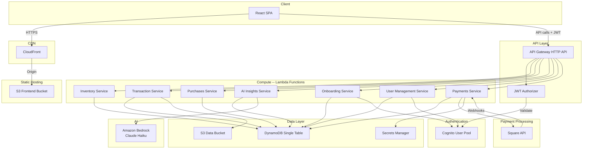
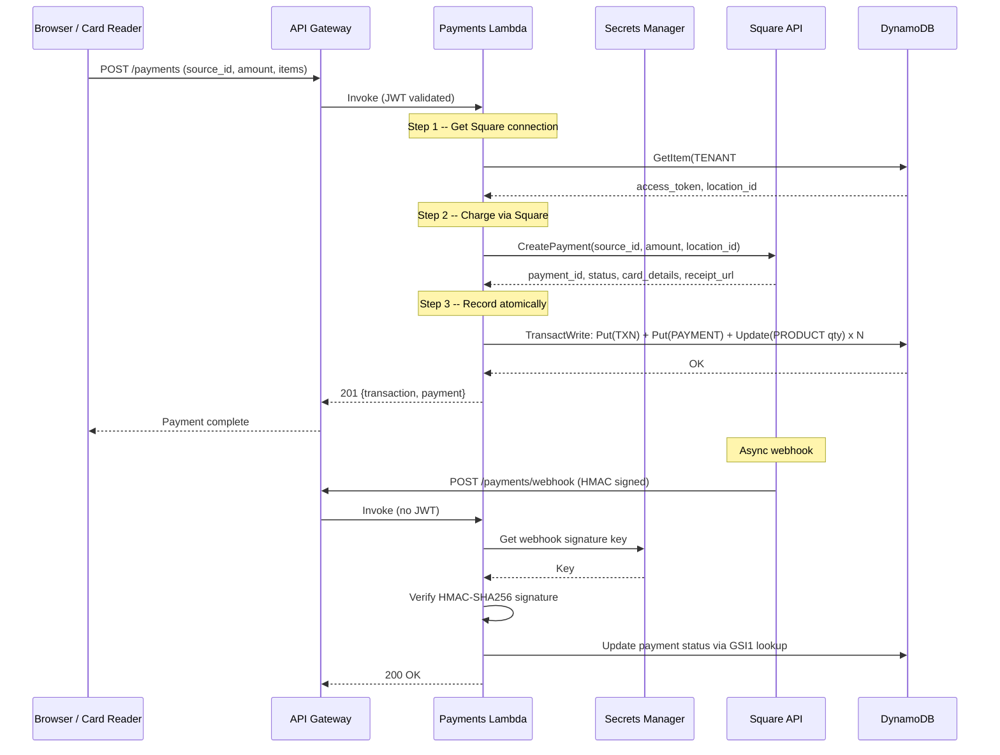
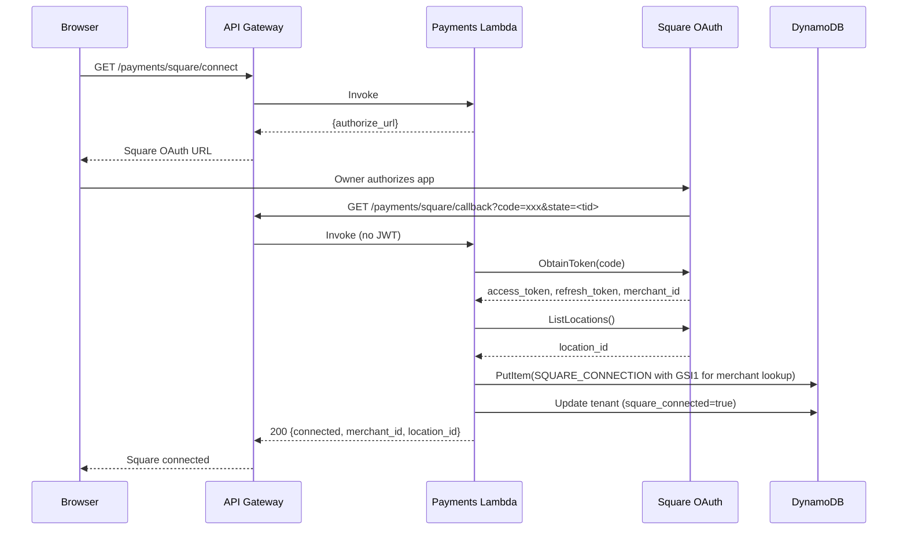

# Clienta AI — Architecture

## System Overview



All services run as Lambda functions (Python 3.12) behind a single API Gateway HTTP API. Data is stored in a single DynamoDB table using a multi-tenant single-table design. The React SPA is served from S3 via CloudFront. Square handles payment processing for both in-store (card readers) and online (Web Payments SDK) transactions. Square credentials are stored in AWS Secrets Manager.

---

## Request Lifecycle


Key points:
- API Gateway validates the JWT before the Lambda is even invoked
- The `@require_auth` decorator extracts `custom:tenant_id` from the JWT claims and injects it into the event
- All DynamoDB queries are scoped to the tenant's partition key, ensuring data isolation

---

## DynamoDB Single-Table Design

All entities share one table. The partition key (`pk`) is always `TENANT#<tenant_id>`, ensuring all of a tenant's data is co-located for efficient queries.

```mermaid
erDiagram
  TABLE {
    string pk "TENANT#<tenant_id>"
    string sk "Entity-specific sort key"
    string gsi1pk "Optional GSI1 partition"
    string gsi1sk "Optional GSI1 sort"
    number ttl "TTL epoch (optional)"
  }
```

### Access Patterns

| Access Pattern                       | PK                          | SK / Key Condition                    | Index    |
| ------------------------------------ | --------------------------- | ------------------------------------- | -------- |
| Get tenant                           | `TENANT#<tid>`              | `TENANT#<tid>`                        | Table    |
| List all products                    | `TENANT#<tid>`              | `begins_with(PRODUCT#)`               | Table    |
| Get one product                      | `TENANT#<tid>`              | `PRODUCT#<pid>`                       | Table    |
| Products by category                 | `TENANT#<tid>`              | `CATEGORY#<cat>`                      | GSI1     |
| List suppliers                       | `TENANT#<tid>`              | `begins_with(SUPPLIER#)`              | Table    |
| List purchase orders                 | `TENANT#<tid>`              | `begins_with(PO#)`                    | Table    |
| List transactions (newest first)     | `TENANT#<tid>`              | `begins_with(TXN#)` desc             | Table    |
| Transactions by date range           | `TENANT#<tid>`              | `between(TXN#<start>, TXN#<end>)`    | Table    |
| Get daily AI insight                 | `TENANT#<tid>`              | `INSIGHT#<YYYY-MM-DD>`                | Table    |
| List users in tenant                 | `TENANT#<tid>`              | `begins_with(USER#)`                  | Table    |
| Get one user                         | `TENANT#<tid>`              | `USER#<uid>`                          | Table    |
| List payments                        | `TENANT#<tid>`              | `begins_with(PAYMENT#)`               | Table    |
| Get Square connection                | `TENANT#<tid>`              | `SQUARE#<tid>`                        | Table    |
| Find payment by Square payment ID    | `SQUARE_PAYMENT#<sq_id>`    | --                                    | GSI1     |
| Find tenant by Square merchant ID    | `SQUARE_MERCHANT#<mid>`     | --                                    | GSI1     |
| Cross-entity query by SK             | --                          | SK as partition key                   | GSI2     |

### Entity Key Patterns

| Entity            | PK             | SK                          | GSI1PK                          | GSI1SK              |
| ----------------- | -------------- | --------------------------- | ------------------------------- | ------------------- |
| Tenant            | `TENANT#<tid>` | `TENANT#<tid>`              | --                              | --                  |
| Product           | `TENANT#<tid>` | `PRODUCT#<pid>`             | `TENANT#<tid>`                  | `CATEGORY#<cat>`    |
| Supplier          | `TENANT#<tid>` | `SUPPLIER#<sid>`            | --                              | --                  |
| Purchase Order    | `TENANT#<tid>` | `PO#<poid>`                 | --                              | --                  |
| Transaction       | `TENANT#<tid>` | `TXN#<timestamp>#<txnid>`   | --                              | --                  |
| AI Insight        | `TENANT#<tid>` | `INSIGHT#<YYYY-MM-DD>`      | --                              | --                  |
| User              | `TENANT#<tid>` | `USER#<uid>`                | --                              | --                  |
| Payment           | `TENANT#<tid>` | `PAYMENT#<payid>`           | `SQUARE_PAYMENT#<sq_id>`        | `TENANT#<tid>`      |
| Square Connection | `TENANT#<tid>` | `SQUARE#<tid>`              | `SQUARE_MERCHANT#<merchant_id>` | `TENANT#<tid>`      |

Transactions use a composite SK with the ISO timestamp first, enabling efficient date-range queries and natural newest-first ordering with `ScanIndexForward=False`.

---

## Authentication Flow

### Signup (Tenant Onboarding)


### Sign In


The frontend uses `amazon-cognito-identity-js` for SRP authentication. JWTs are stored in memory (not localStorage) and attached as `Authorization: Bearer <token>` on every API call.

---

## AI Insights Pipeline


Key design decisions:
- Insights are generated on-demand (not scheduled) to minimize Bedrock costs
- Results are cached in DynamoDB with a 7-day TTL for automatic cleanup
- The prompt includes structured business data (inventory stats, transaction summaries) for grounded analysis
- Claude Haiku is used for cost efficiency (~$0.25/M input tokens)

---

## Square Payment Flow

### Card Payment (In-Store or Online)



### OAuth Connection (One-Time Setup)



Key design decisions:
- Square access tokens are stored per-tenant in DynamoDB (encrypted at rest), not in environment variables
- GSI1 is used for webhook lookups: `SQUARE_PAYMENT#<id>` finds the payment record, `SQUARE_MERCHANT#<id>` finds the tenant
- Payments and transactions are written atomically with inventory decrements using DynamoDB `TransactWriteItems`
- Cash payments bypass Square API but still go through the same transaction + inventory pipeline
- Webhook signatures are verified using HMAC-SHA256 with a key from Secrets Manager
- Square app secret is stored in Secrets Manager, never in Terraform variables or Lambda env vars

---

## Multi-User Tenant Model

Each tenant supports multiple users with a role hierarchy:

| Role      | Level | Can Invite       | Can Manage       |
| --------- | ----- | ---------------- | ---------------- |
| `owner`   | 3     | managers + staff | managers + staff |
| `manager` | 2     | staff only       | staff only       |
| `staff`   | 1     | nobody           | nobody           |

Users are created in both Cognito (for authentication) and DynamoDB (for tenant-scoped queries). The `custom:tenant_id` and `custom:role` JWT claims ensure data isolation and role enforcement at every API call.

---

## Cost Architecture


At 0-50 customers, estimated monthly cost is $5-25 (mostly Bedrock calls). Caching AI insights daily per tenant keeps Bedrock usage minimal.
